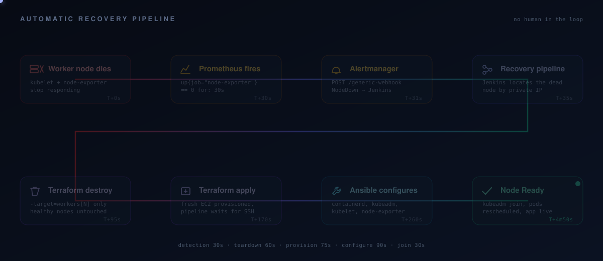
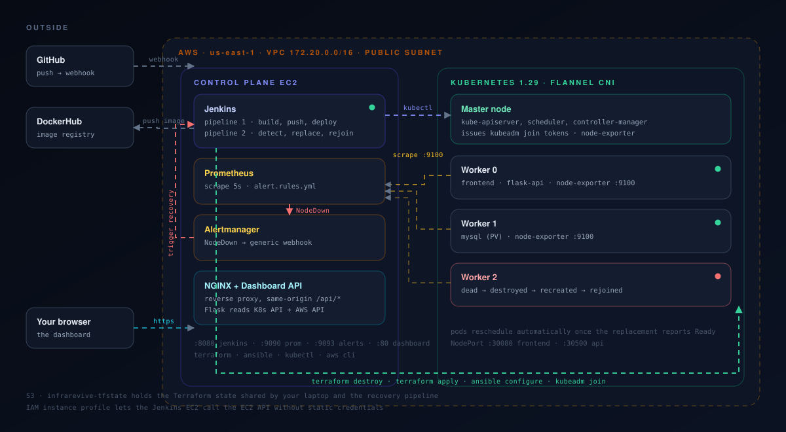

<div align="center">



<br>


<br><br>

**When a Kubernetes worker node dies, nobody gets paged.**<br>
The cluster notices, tears the dead machine down, builds a new one, configures it,
puts it back in the cluster, and reschedules the workload — in under five minutes,
with no human touching anything.

</div>

<br>

---

## What this is

InfraRevive is a self-healing infrastructure platform built on AWS. Most monitoring
setups stop at *telling you* something broke. This one closes the loop: detection
feeds straight into an automated repair pipeline that provisions a genuine
replacement machine and rejoins it to the cluster.

Three things make it work together:

- **A real cluster, not a simulation.** Five EC2 instances in a VPC built by
  Terraform, a Kubernetes cluster stood up with `kubeadm` and Flannel by Ansible,
  and a three-tier application (NGINX, Flask, MySQL) actually running on it.
- **Detection wired to action.** Prometheus scrapes node-exporter every five
  seconds. When a node stops answering for thirty, Alertmanager fires a webhook
  straight into a Jenkins recovery pipeline — no email, no dashboard someone has to
  be watching.
- **Surgical repair.** The pipeline destroys and recreates *only* the dead worker
  by its Terraform index. Healthy nodes are never touched, and state lives in S3 so
  the pipeline and your laptop always agree on what exists.

<br>

## See it running

The dashboard is served by NGINX on the Jenkins box and pulls live data from the
Prometheus, Kubernetes, AWS, Jenkins and Alertmanager APIs. Nothing on it is mocked.
Below is what a failure and recovery actually look like as they happen:

<div align="center">

</div>

Four views: the overview above, a full sixteen-column node table, a recovery
timeline showing each pipeline stage with timestamps, and an active alerts table.
Light and dark themes, and a click on any node opens its conditions, pods, capacity
and EC2 metadata.

<br>

## The recovery loop

<div align="center">

</div>

The pipeline identifies the dead node by matching **private** IPs against
`kubectl get nodes` — kubelet registers with the private IP, and public IPs change
on every stop/start, so matching on public IPs is the bug that eats a weekend.

<br>

## Architecture

<div align="center">

</div>

Two pipelines run on the same Jenkins instance:

**Pipeline 1 — CI/CD.** A push to `main` fires a GitHub webhook. Jenkins builds the
Flask and NGINX images, pushes them to DockerHub, and rolls them out to Kubernetes.

**Pipeline 2 — Recovery.** Triggered by Alertmanager, never by a person. It removes
the ghost node object, runs a targeted `terraform destroy` and `terraform apply`,
updates the Prometheus scrape targets, waits for SSH on the new instance,
regenerates the Ansible inventory, pulls a fresh join token from the master, runs
the worker playbook, and verifies the node reports `Ready` with pods rescheduled.

<br>

## Stack

| Layer | Technology | Role |
|---|---|---|
| Cloud | AWS EC2, VPC, IAM, S3 | Five instances in one public subnet, remote Terraform state |
| Infrastructure | Terraform 1.6+ | VPC, subnets, security groups, IAM, EC2, S3 backend |
| Configuration | Ansible | Idempotent node provisioning — containerd, kubeadm, kubelet, node-exporter |
| CI/CD | Jenkins | Deploy pipeline and recovery pipeline |
| Orchestration | Kubernetes 1.29 + Flannel | Scheduling, self-healing, pod rescheduling |
| Monitoring | Prometheus + node-exporter | CPU, RAM, disk, network, node liveness at 5s resolution |
| Alerting | Alertmanager | Webhook trigger into the recovery pipeline |
| Dashboard | Vanilla HTML/CSS/JS + Flask | Real-time UI, no framework, no build step |
| Application | NGINX, Flask, MySQL 8.0 | Student Result Portal on NodePort services |
| Registry | DockerHub | Image storage between build and deploy |

<br>

## Getting started

Two guides, depending on where you are:

| | |
|---|---|
| **[INSTALLATION.md](INSTALLATION.md)** | First time on a fresh AWS account. Tools, key pair, state bucket, Terraform, Ansible, application deploy, Jenkins wiring, and a recovery drill to prove it works. |
| **[STARTUP.md](STARTUP.md)** | Every session after that. Two commands, plus what `start-all.sh` repairs behind the scenes and how to check it came up clean. |

The short version, once installed:

```bash
cd ~/project/infrarevive
./start-all.sh          # bring the whole platform up
./stop-all.sh           # put it to sleep, nothing destroyed
```

<br>

## Repository layout

```
infrarevive/
├── terraform/              VPC, subnets, security groups, IAM, EC2, S3 backend
├── ansible/                setup-master.yml, setup-workers.yml, ansible.cfg
├── kubernetes/             namespace, config, secret, PV, deployments, services, flannel
├── app/                    Flask API — the Student Result Portal backend
├── frontend/               NGINX-served static UI
├── dashboard/              Real-time monitoring dashboard (single page, no build step)
├── dashboard-api/          Flask backend that reads the Kubernetes and AWS APIs
├── prometheus/             Scrape config, alert rules, Alertmanager config
├── nginx/                  Reverse proxy — keeps every dashboard API call same-origin
├── docs/                   Architecture, deployment, recovery flow, API, troubleshooting
├── Jenkinsfile-CICD        Pipeline 1 — build, push, rolling update
├── Jenkinsfile-Recovery    Pipeline 2 — detect, destroy, recreate, configure, rejoin
├── start-all.sh            Start and fully repair the platform
├── stop-all.sh             Stop everything, preserve all state
├── setup-config.sh         Fill live IPs into inventory, Prometheus and the dashboard
└── deploy-dashboard.sh     Redeploy the dashboard and its API only
```

<br>

## Documentation

| Document | What's in it |
|---|---|
| [Architecture](docs/ARCHITECTURE.md) | Component design and how the pieces talk |
| [Setup](docs/SETUP.md) | Prerequisites and initial environment |
| [Deployment](docs/DEPLOYMENT.md) | Phase-by-phase production deployment |
| [Recovery Flow](docs/RECOVERY-FLOW.md) | The recovery pipeline, stage by stage |
| [Pipelines](docs/PIPELINES.md) | Both Jenkinsfiles explained |
| [Dashboard](docs/DASHBOARD.md) | Views, data sources, refresh behaviour |
| [API](docs/API.md) | Every endpoint across the dashboard API, Flask app and proxies |
| [Debian Setup](docs/DEBIAN-SETUP.md) | Full walkthrough on Debian/Ubuntu hosts |
| [Troubleshooting](docs/TROUBLESHOOTING.md) | The failures that actually happen, and the fixes |

<br>

## Engineering decisions worth explaining

**Match nodes on private IPs, not public ones.** Kubelet registers itself with the
private IP. EC2 hands out a new public IP on every stop/start. The recovery pipeline
matches on private IPs so it always deletes the right node object.

**Targeted Terraform, not a full apply.** `-target=aws_instance.k8s_workers[N]`
touches exactly the dead worker. A blanket apply during an incident is how you turn
one dead node into three.

**Instance IDs come from Terraform state, not AWS tags.** Terminated instances stay
visible in the EC2 API for up to an hour and keep their `Name` tag, so tag lookups
silently match ghosts after a destroy/recreate cycle. State only ever tracks the
resource that actually exists.

**Prometheus scrapes private IPs.** Public IPs churn; private IPs survive
stop/start. Scraping public IPs means alerting quietly breaks every morning.

**A dashboard instead of email alerts.** No SMTP, no app passwords, no alert fatigue
— just a live view that shows what the system is doing while it repairs itself.

**A reverse proxy in front of everything.** Browsers can't sign AWS requests or
present Kubernetes client certs, and cross-origin calls to Prometheus and Jenkins
would be blocked anyway. NGINX makes every call same-origin and a small Flask
service does the privileged reads.

<br>

---

<div align="center">
<sub>Built as a final-year B.Tech project — a working, self-healing production pattern rather than a demo.</sub>
</div>
